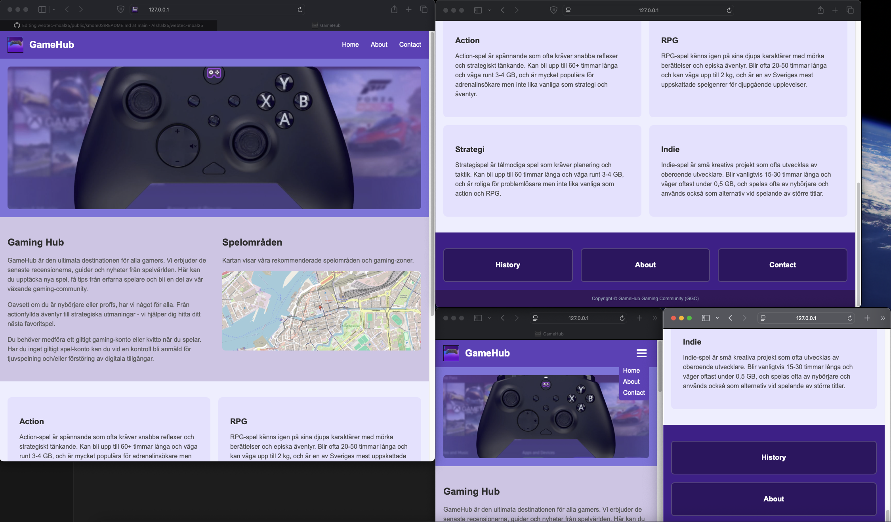

# Webb

# Redovisningstexter

## Kmom03

🎮 För min one-page webbplats valde jag temat GameHub, en gaming-community webbplats. Gaming är något jag har stor passion för, så det kändes naturligt att bygga en sida kring något jag verkligen brinner för. Webbplatsen handlar om att samla gamers, erbjuda recensioner, guider och skapa en community för spelare. När det kommer till färgpaletten använder jag en lila/purple tema med #6b46c1 som huvudfärg i headern, och sedan olika nyanser av lila genom hela sidan - från ljusa lila bakgrunder till mörkare lila för footern. Detta skapar en harmonisk färgskala som känns sammanhållen.
🖼️ För att hitta bilder och material använde jag mig av Xbox Game Pass, som jag anpassade till gaming-temat. Texten skrev jag själv och fokuserade på innehåll som kändes relevant för en gaming-webbplats, som information om spelgenrer, community-funktioner och gaming-zoner. Min huvudsakliga inspiration kom från referenswebbplatsen som visades, där jag kunde se hur en professionell one-page layout fungerar med hero-image, tvåkolumns-innehåll och kortsektioner.

🎨 Den största utmaningen var att balansera färgtemat. Först blev det alldeles för mycket lila överallt vilket såg ut som ett filter över hela sidan. Jag fick lära mig att använda färg mer sparsamt och strategiskt. En annan utmaning var att få mobilmenyn att fungera ordentligt - jag behövde justera media queries och förstå hur JavaScript och CSS arbetar tillsammans för responsiv design. Tidspressen var också en faktor som påverkade mina beslut. Jag övervägde att lägga till smooth scrolling-animationer när man klickar på navigationen så att sidan skulle glida upp till rätt sektion istället för att bara hoppa dit direkt, men när jag kollade uppgiftsbeskrivningen mer noggrant stod det inte som ett krav så jag valde att ta bort det för att fokusera på grundfunktionaliteten istället.

📚 För någon som är nybörjare på CSS skulle jag säga att det viktigaste är att börja med grunderna och inte försöka göra för komplicerat från början. Lära sig margin och padding först, sedan display och position. Flexbox och Grid kommer också vara användbara tidigt. Det hjälper att testa en sak i taget och se vad som händer. Utvecklarverktygens inspektör är också väldigt bra för att förstå vad som pågår.

⚡ Jämfört med kmom01 har jag utvecklats en hel del. I kmom01 experimenterade jag mycket med olika CSS-tekniker och animationer, vilket var bra för att praktisera den typen av kod och förstå vad som var möjligt. Men för kmom03 valde jag medvetet en enklare väg. Min kod är nu mycket enklare och mer läsbar. Jag har bättre färghantering, från den beige/orange paletten i kmom01 till en sammanhållen lila-tema. Layout-strukturen är också förbättrad, från det komplexa profile-layout systemet till ett enklare grid-system.

⌛ Den begränsade tiden påverkade också mina designbeslut. Jag tog bort de komplexa hover-effekterna som fanns i kmom01 eftersom jag inte hade tid att implementera dem på ett bra sätt och de kändes inte nödvändiga för grundfunktionaliteten. JavaScript är också förenklat från komplex hamburger-animation till basic toggle-funktionalitet. Jag minskade användningen av CSS-transitions och avancerade selectors, vilket faktiskt gjorde koden mer läsbar.

✨ Min största lärdom för detta kmom är vikten av att hålla det enkelt och fokusera på det som verkligen behövs. Jag lärde mig att det är bättre att ha en färg som används rätt än att försöka använda den överallt. Jag förstod också värdet av att prioritera grundfunktionalitet över fancy animationer, särskilt när tiden är begränsad. Detta gjorde koden mycket lättare att arbeta med än kmom01, där jag hade gjort det mer komplicerat än nödvändigt.